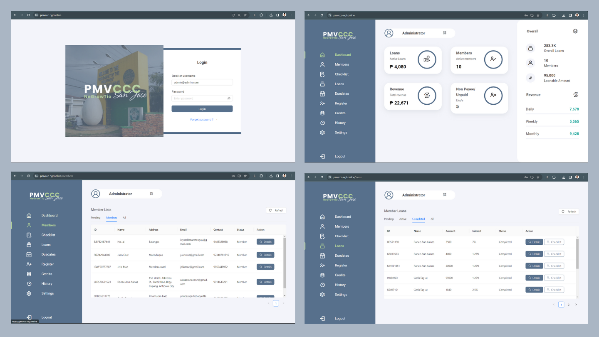

# PMVCCC Website Application

## Overview

NeGrowTio: A Lending Management System For Public Market Vendors And The Community In San Jose Batangas. An administrative application for monitoring members or borrowers, non-payee/unpaid members, loans with dues and duedates, revenue and total loans, member share capital and credit score, tracking payments and histories, using push notifications for updates.

See mobile appliation version [here](https://github.com/monrealljeriko/NGTApp-Mobile)

## Preview

## Content Credits:

- Video: [YouTube Video](https://youtu.be/o6XK4L1z5zI)
- GitHub Repository: [GitHub Repository](https://github.com/trananhtuat/ecommerce-dashboard/)
